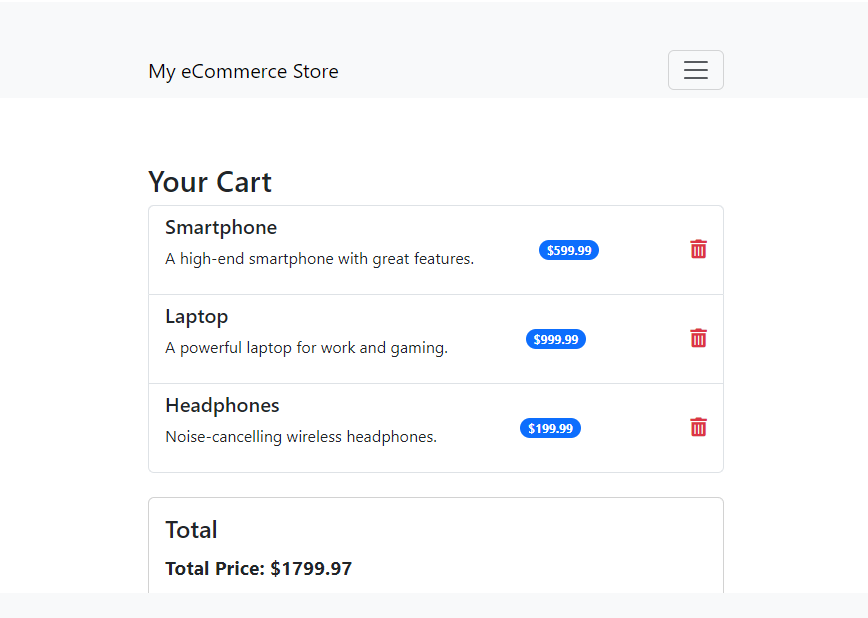

# Flask eCommerce Website with Stripe Integration

This is a simple eCommerce website built using Flask. The website allows users to browse products, add them to a shopping cart, and proceed to checkout. It uses **Stripe** for handling payments in test mode. The website also supports user registration and login functionality.

## Features

- User authentication (login, registration, logout)
- Product listing with images and descriptions
- Shopping cart functionality
- Remove items from the cart
- Checkout using **Stripe** for payments
- Payment success and cancellation pages
- Responsive UI using **Bootstrap**
- Product image handling (supports `.webp`, `.jpg`, etc.)

## Technologies Used

- **Flask** (Python Web Framework)
- **Flask-Login** (User Authentication)
- **Flask-SQLAlchemy** (Database ORM)
- **Stripe API** (Payment Integration)
- **Bootstrap** (CSS Framework for UI)
- **SQLite** (Database)
- **HTML5 & CSS3** (Frontend)

## Installation

### Prerequisites

- Python 3.x
- Flask and required Python packages (specified in `requirements.txt`)
- A Stripe account (for API keys, even in test mode)

### Setting Up Locally

1. **Clone the repository**:

    ```bash
    git clone https://github.com/yourusername/your-repo-name.git
    cd your-repo-name
    ```

2. **Set up a virtual environment** (optional but recommended):

    ```bash
    python -m venv venv
    source venv/bin/activate  # On Windows: venv\Scripts\activate
    ```

3. **Install dependencies**:

    ```bash
    pip install -r requirements.txt
    ```

4. **Set up environment variables** for Stripe keys and Flask:

    - Create a `.env` file in the project root and add your **Stripe** test keys and **Flask secret key**:

      ```bash
      STRIPE_PUBLIC_KEY=your_stripe_public_key
      STRIPE_SECRET_KEY=your_stripe_secret_key
      FLASK_SECRET_KEY=your_flask_secret_key
      ```

5. **Set up the SQLite database**:

    ```bash
    flask shell
    >>> from app import db
    >>> db.create_all()
    ```

6. **Insert product data** (optional):

    - Run the provided script to insert sample products into the database.

    ```bash
    python insert_products.py
    ```

7. **Run the Flask app**:

    ```bash
    flask run
    ```

8. Visit the app at `http://localhost:5000/`.

## Usage

1. **Home Page**: Browse products and view their details.
2. **Add to Cart**: Add products to your cart. The total will be calculated and displayed.
3. **Login/Registration**: Users can register and log in to manage their cart and make purchases.
4. **Checkout**: Proceed to checkout using **Stripe**. You can use the following test card number for payments in test mode:

    ```
    Card Number: 4242 4242 4242 4242
    Expiry Date: Any future date (e.g., 12/34)
    CVC: Any 3 digits (e.g., 123)
    ```

5. **Payment Success**: After successful payment, the user is redirected to a confirmation page.

## Project Structure


## Screenshots

### Home Page


### Shopping Cart


### Payment Success


## Stripe Test Mode

This project uses **Stripe's Test Mode** to simulate payments. Use the provided test card numbers for checkout. Refer to [Stripe's documentation](https://stripe.com/docs/testing#international-cards) for more test scenarios.

## Contributing

1. Fork the repository.
2. Create a new branch (`git checkout -b feature-branch`).
3. Make your changes.
4. Commit your changes (`git commit -am 'Add new feature'`).
5. Push to the branch (`git push origin feature-branch`).
6. Create a new Pull Request.

## License

This project is licensed under the MIT License - see the [LICENSE](LICENSE) file for details.


